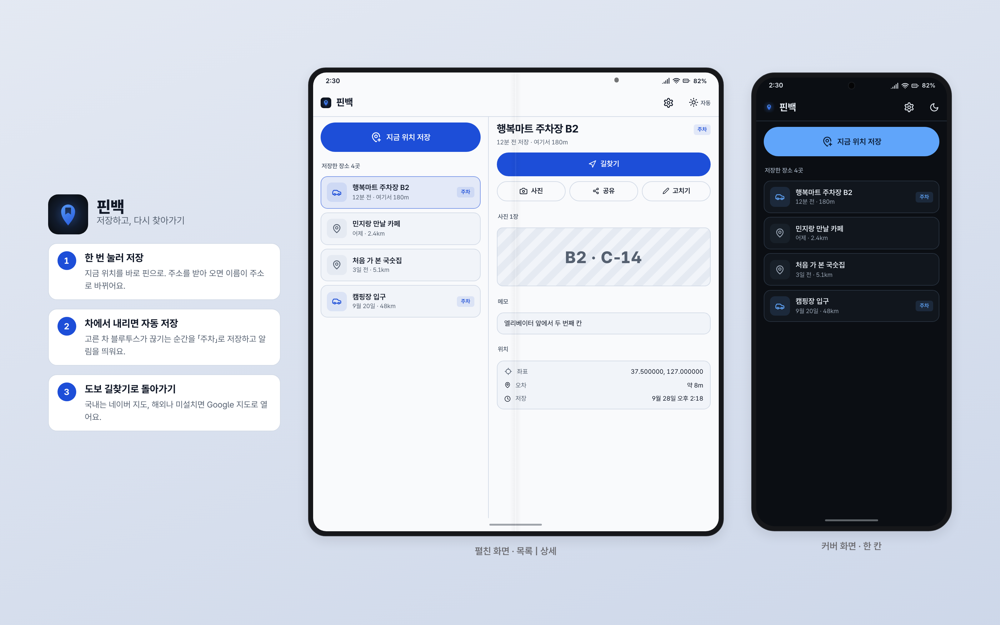
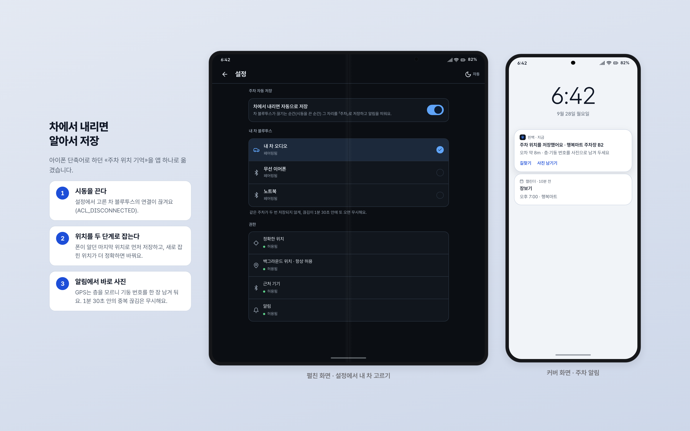
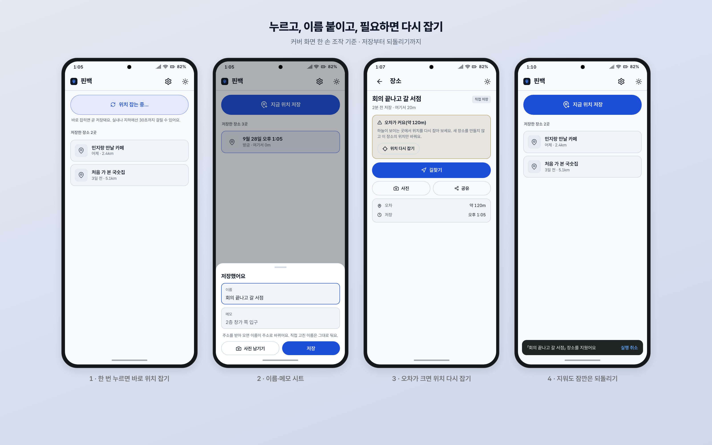
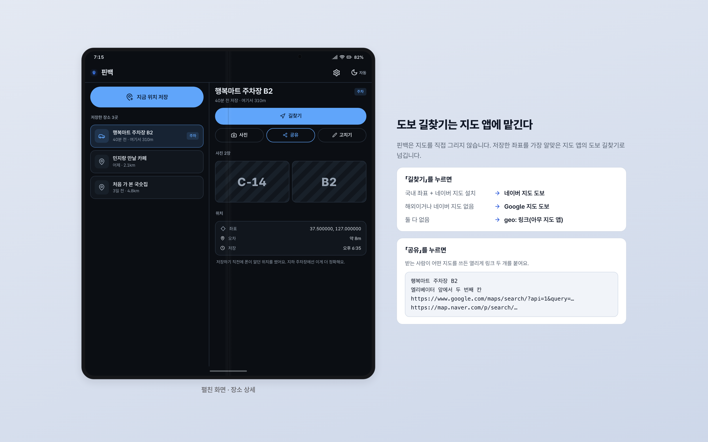
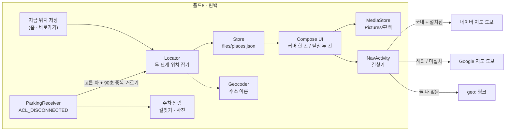

# 핀백 Pinback

지금 있는 곳을 한 번에 저장해 두고, 나중에 도보 길찾기로 다시 찾아가는 안드로이드 앱입니다.

> **English** — Pinback saves where you are with one tap and walks you back there later.
> When your car's Bluetooth disconnects, it saves the parking spot automatically and offers a photo of the pillar number.
> Navigation is handed to Naver Map (walking) inside Korea and Google Maps (walking) elsewhere; the layout adapts to the Fold cover and inner screens.

동작 확인: Galaxy Z Fold8 (Android 17) · macOS 26


화면은 설명용 목업입니다.

## 왜 만들었나

저는 10년 가까이 아이폰을 쓰다가 Galaxy Z Fold8 로 옮겼습니다. 맥과 폰 사이의 연동을 직접 만들어 쓰는 중인데, 옮기고 나서 제일 먼저 아쉬웠던 건 뜻밖에도 아이폰 «단축어»였습니다. 특히 차 블루투스가 끊기면 주차 위치를 저장해 두는 단축어를 자주 썼습니다.

안드로이드에서는 모드 및 루틴, Tasker, MacroDroid 같은 대안을 살펴봤습니다. 제가 원하는 건 딱 한 가지 동작이었고, 유료 자동화 앱 하나를 배우는 것보다 작은 앱을 직접 만드는 편이 빠르다고 판단했습니다. 처음에는 맥 연동 앱(ClipBridge) 안의 「주차 위치」 기능으로 붙였다가, 맥 연동과 관계가 없는 기능이라 따로 떼어 핀백이 됐습니다. 떼어 내면서 ClipBridge 의 권한은 16개에서 11개로 줄었습니다. 주차는 이제 핀백의 여러 용도 중 하나입니다. 처음 가 본 가게나 약속 장소도 같은 방식으로 저장합니다.

## 스크린샷


화면은 설명용 목업입니다.


화면은 설명용 목업입니다.


화면은 설명용 목업입니다.

## 기능

1. **지금 위치 저장**: 홈 맨 위 큰 버튼을 누르면 바로 위치를 잡아 저장하고, 이름·메모를 고치는 시트가 뜹니다. 기본 이름은 시각(「9월 27일 오후 1:05」)이고, 주소를 받아 오면(Geocoder, 네트워크 필요) 주소로 바뀝니다. 직접 고친 이름은 건드리지 않습니다.
2. **두 단계 위치 잡기**: 폰이 알던 마지막 위치로 먼저 저장하고, 새로 잡힌 위치가 더 정확하면(또는 마지막 위치가 5분 넘게 묵었으면) 바꿉니다. 지하 주차장에서는 들어가기 직전 위치가 더 정확한 경우가 많습니다.
3. **위치 다시 잡기**: 오차가 크면 상세 화면에 경고와 함께 버튼이 나옵니다. 새 장소를 만들지 않고 그 장소의 위치만 다시 잡습니다.
4. **장소 목록·상세**: 최신순 목록에 이름·저장 시각(「3분 전」)·지금 위치에서의 거리·종류(직접 저장 / 주차)를 보여 줍니다. 상세에는 길찾기, 사진 남기기/크게 보기, 공유, 이름·메모 고치기, 좌표·오차, 지우기(8초 안에 실행 취소)가 있습니다.
5. **주차 자동 저장**: 설정에서 페어링된 기기 중 «내 차»를 고르면, 그 블루투스 연결이 끊기는 순간(`ACL_DISCONNECTED`) 「주차」로 저장하고 알림을 띄웁니다. 알림에서 바로 길찾기와 사진 남기기를 할 수 있습니다. 끊김이 1분 30초 안에 두 번 오면 한 번만 저장합니다.
6. **길찾기**: 국내 좌표이고 네이버 지도가 있으면 네이버 지도 도보(`nmap://route/walk`), 해외이거나 네이버 지도가 없으면 Google 지도 도보, 둘 다 없으면 `geo:` 링크로 넘깁니다.
7. **공유**: 받는 사람이 어떤 지도를 쓰든 열리도록 Google 지도·네이버 지도 링크를 둘 다 붙입니다.
8. **바로가기**(아이콘 길게 누르기): 「지금 위치 저장」, 「마지막 장소로 길찾기」.
9. **폴드 자세**: 커버(좁은 화면)는 한 칸(목록 ↔ 상세), 펼침(폭 840dp 이상)은 목록 | 상세 두 칸입니다. 접고 펴도 보던 화면이 유지됩니다.
10. **테마**: 우상단 버튼으로 자동(폰 설정) → 밝게 → 어둡게. 라이트·다크 모두 글자 대비 AA(4.5:1) 이상으로 맞췄습니다.

장소 목록은 폰 안(`files/places.json`)에만 저장하고 어디로도 보내지 않습니다. 사진은 사진첩 `Pictures/핀백` 폴더에 들어갑니다.

## 구조



```
android/app/src/main/java/kr/joonlab/pinback/
  Places.kt        Place 데이터 · Store(JSON 파일, Compose 상태)
  Locator.kt       권한 확인 · 두 단계 위치 잡기 · 역지오코딩 · 지도(길찾기·공유·거리)
  Parking.kt       내 차 고르기 · ParkingReceiver(ACL_DISCONNECTED) · 주차 알림
  AppModel.kt      화면 상태 · 저장 흐름 · 사진(MediaStore)
  MainActivity.kt  홈. 바로가기 SAVE · 알림 OPEN/PHOTO 를 받는다
  NavActivity.kt   화면 없는 길찾기(바로가기 · 알림)
  ui/              Theme · Icons(lucide) · Parts · App · Home · Detail · Settings
```

## 준비물

- Android 11(API 30) 이상 폰. 저는 Galaxy Z Fold8 에서만 확인했습니다.
- JDK 21, Android SDK(compileSdk 36)
- 빌드 도구: Gradle 9.7.1(wrapper 포함) · AGP 9.4.1(Kotlin 내장, `kotlin.android` 플러그인을 넣지 않음) · Compose 컴파일러 2.4.20 · Compose BOM 2026.06.01(2026.08 이상은 compileSdk 37 을 요구해서 고정)
- 네이버 지도 또는 Google 지도 앱(길찾기용, 없으면 `geo:` 로 넘김)

## 설치

```bash
git clone https://github.com/joonlab/pinback.git
cd pinback
cp android/local.properties.example android/local.properties   # sdk.dir 채우기
export JAVA_HOME=/path/to/jdk-21

./android/gradlew -p android assembleDebug
# → android/app/build/outputs/apk/debug/app-debug.apk

./android/dev.sh build   # 빌드만
./android/dev.sh run     # 빌드 → 연결된 폰에 설치 → 실행
./android/dev.sh log     # 앱 로그
```

`dev.sh` 는 `adb devices` 에 기기가 한 대만 보이면 그 기기에 설치합니다. 여러 대면 `ANDROID_SERIAL` 로 고르고, 무선 adb 로 붙어야 하면 `PINBACK_ADB_CONNECT=<host:port>` 를 주면 먼저 `adb connect` 합니다.

## 설정

앱을 처음 열면 설정 화면에서 권한 네 개(정확한 위치 · 백그라운드 위치 · 근처 기기 · 알림)의 상태를 보고 바로 허용할 수 있습니다. 주차 자동 저장을 쓰려면 **설정 → 내 차 블루투스** 에서 페어링 목록 중 차를 고르면 됩니다.

| 권한 | 왜 필요한가 | 없으면 |
|---|---|---|
| 정확한 위치 | 장소를 저장한다 | 저장 불가(홈에 「위치 허용」 안내) |
| 백그라운드 위치(항상 허용) | 앱이 닫혀 있어도 차에서 내릴 때 저장 | 주차 자동 저장이 멈춤(홈에 경고) |
| 근처 기기(Android 12+) | 차 블루투스 끊김 감지 · 페어링 목록 | 주차 자동 저장 멈춤 · 차 고르기 불가 |
| 알림(Android 13+) | 주차 저장 알림 | 조용히 저장만 됨 |
| 인터넷 | Geocoder 가 주소를 받아 올 때만 | 이름이 시각으로 남음 |

선택 설정 하나가 빌드 때 들어갑니다. 설정 화면에서 아직 차를 고르지 않았을 때 쓸 기본 블루투스 이름입니다. 비워 두면(기본값) 차를 고를 때까지 주차 자동 저장은 동작하지 않습니다.

```properties
# android/local.properties  (저장소에 올라가지 않음)
pinback.defaultCarName=My Car Audio
```

또는 `./android/gradlew -p android assembleDebug -Ppinback.defaultCarName="My Car Audio"`.

## 알려진 한계

- **차 블루투스 자동 저장은 아직 실제 차에서 재 보지 못했습니다.** 수신기 코드는 ClipBridge 시절 동작을 옮긴 것이고, 분리 후 실기 QA 에서는 저장·편집·삭제·되돌리기·설정·바로가기·위치 다시 잡기·커버/펼침 레이아웃까지만 확인했습니다.
- **카메라로 사진 남기기**도 분리 후에는 실측하지 않았습니다.
- **국내 네이버 지도 도보 경로**는 실측하지 않았습니다. 시험할 때 폰이 해외에 있어서 Google 지도 쪽 분기만 실제로 탔습니다. 국내 판정은 위경도 사각형(대략 북위 33~38.7°, 동경 124.5~131°)이라 경계 근처 해외 좌표가 국내로 잡힐 수 있습니다.
- GPS 는 층을 모릅니다. 지하 주차장에서는 오차가 크게 나올 수 있고, 그래서 기둥 번호 사진을 권합니다.
- 삼성 One UI 의 배터리 최적화가 백그라운드 수신을 늦추는지는 확인하지 않았습니다.
- 백업·동기화 기능은 없습니다. 장소는 그 폰 안에만 있습니다.

## 만든 과정

Claude Code 와 며칠에 걸쳐 만들었습니다. 첫날 아이폰 단축어의 안드로이드 대안을 조사하다가 ClipBridge 안에 주차 기능을 붙였고, 사흘 뒤 따로 떼어 여러 장소를 저장하는 앱으로 다시 짰습니다. 떼어 낸 뒤에는 실기 QA 와 독립 리뷰를 거쳤고, 리뷰 점수는 8.0 에서 8.6 이 됐습니다.

기억에 남는 삽질과 교훈은 이렇습니다.

- **자동화 앱을 사기 전에 필요한 동작을 세어 보기.** Tasker 의 Play 스토어 페이지까지 열어 봤다가, 제가 필요한 건 «이 블루투스가 끊기면 위치 저장» 하나뿐이라는 걸 확인하고 앱을 직접 만들었습니다. 자동화 앱을 통째로 따라 만드는 대신 필요한 동작 하나만 만들었습니다.
- **성격이 다른 기능은 일찍 떼기.** 주차 기능이 맥 연동 앱에 들어가 있으니 권한만 늘었습니다. 분리하고 나서 ClipBridge 권한이 16개에서 11개로 줄었고, 핀백은 여러 장소를 다루는 앱으로 자랄 수 있었습니다.
- **브로드캐스트 수신기는 위치 콜백을 기다려 줘야 한다.** `ACL_DISCONNECTED` 를 받자마자 끝내면 위치를 다듬기 전에 프로세스가 죽을 수 있습니다. `goAsync()` 로 35초를 붙잡아 두고(백그라운드 브로드캐스트 ANR 한도 60초 안), 처음 9초로 뒀던 값을 늘렸습니다.
- **개인 흔적은 기본값에 숨는다.** 처음 버전은 제 차 블루투스 이름이 코드 기본값에 박혀 있었습니다. 공개본에서는 빌드 설정(`pinback.defaultCarName`)으로 빼고 기본은 빈 값으로 두었습니다.

<!-- VIDEO -->

## 관련 프로젝트

- 허브: https://github.com/joonlab/android-mac-lab (폴드8 ↔ 맥 연동 앱 모음)

## 라이선스

MIT. [LICENSE](LICENSE) 를 보세요. 번들한 Pretendard 글꼴(SIL OFL 1.1)과 Lucide 아이콘 경로(ISC)는 각자의 라이선스를 따릅니다. [THIRD_PARTY_NOTICES.md](THIRD_PARTY_NOTICES.md)
